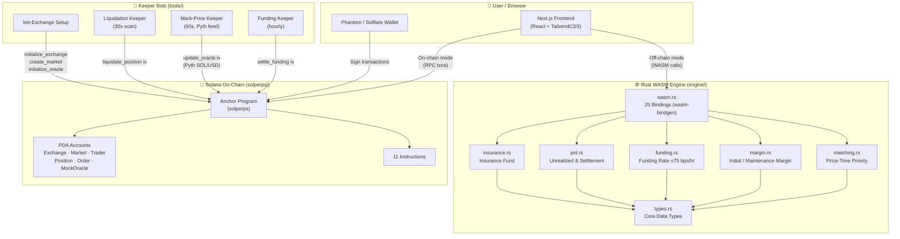
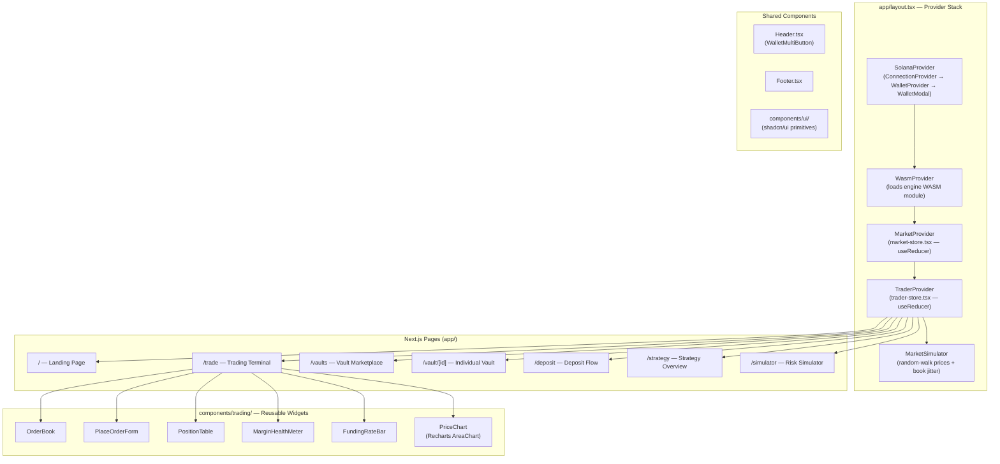
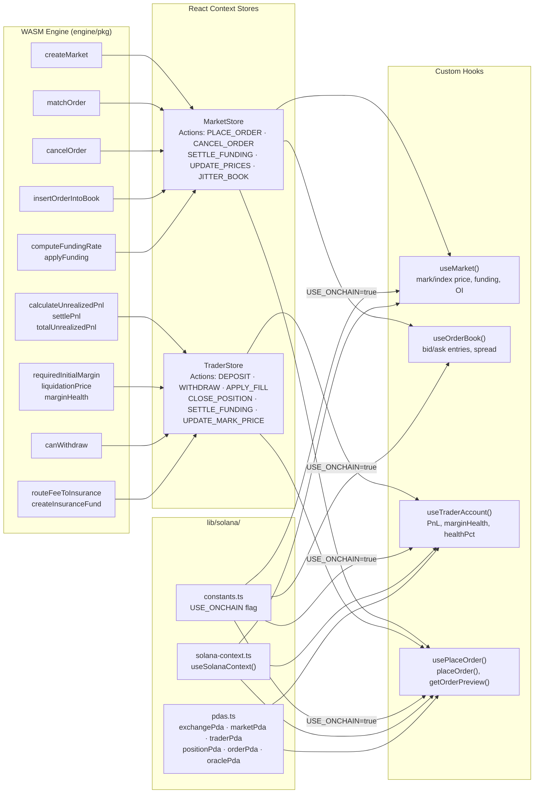
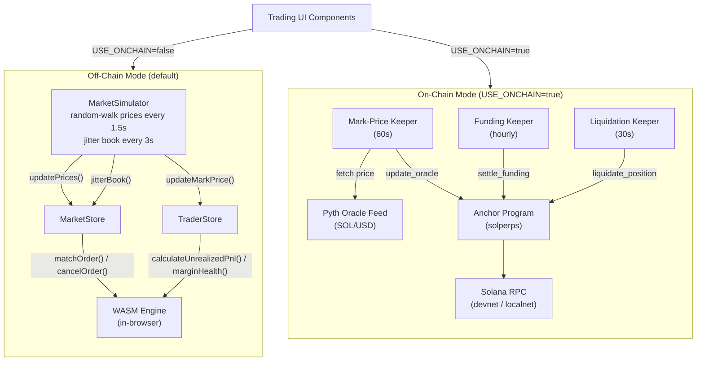
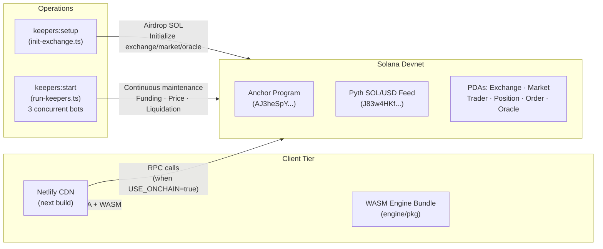

# Aegis — Architecture

> Hybrid on-chain / off-chain perpetuals vault & trading platform on Solana.

---

## 1. High-Level System Overview

---

## 2. Frontend Provider & Component Tree

---

## 3. Data Layer — Stores & Hooks

---

## 4. Solana Anchor Program — Instructions & Accounts

```mermaid
graph TB
    subgraph STATE["On-Chain State Accounts (PDAs)"]
        EXCHANGE["Exchange<br/>admin · usdc_mint · insurance_vault<br/>insurance_balance · bump"]
        MARKET["Market<br/>symbol · mark/index_price · open_interest<br/>fee_bps · next_order_id · last_funding_ts"]
        TRADER["TraderAccount<br/>owner · collateral · locked_margin"]
        POSITION["Position<br/>trader · market · side · size<br/>entry_price · margin_allocated · unrealized_pnl"]
        ORDER["Order<br/>market · trader · order_id · side<br/>order_type · price · size · leverage"]
        ORACLE["MockOracle<br/>market · price · authority"]
    end

    subgraph IX["Instructions (11)"]
        IX1["initialize_exchange"]
        IX2["create_market"]
        IX3["initialize_trader"]
        IX4["deposit_collateral"]
        IX5["withdraw_collateral"]
        IX6["place_order"]
        IX7["cancel_order"]
        IX8["settle_funding"]
        IX9["liquidate_position"]
        IX10["initialize_oracle"]
        IX11["update_oracle"]
    end

    subgraph MATH["math.rs — Fixed-Point Arithmetic"]
        M1["margin_check()"]
        M2["compute_pnl()"]
        M3["compute_funding()"]
        M4["is_liquidatable()"]
    end

    IX1 --> EXCHANGE
    IX2 --> MARKET
    IX3 --> TRADER
    IX4 --> TRADER
    IX5 --> TRADER
    IX6 --> ORDER
    IX6 --> POSITION
    IX6 --> MARKET
    IX7 --> ORDER
    IX8 --> POSITION
    IX8 --> MARKET
    IX9 --> POSITION
    IX9 --> EXCHANGE
    IX10 --> ORACLE
    IX11 --> ORACLE

    IX6 --> M1
    IX5 --> M1
    IX9 --> M4
    IX8 --> M3
    IX6 --> M2
```

---

## 5. Dual-Mode Data Flow (Off-Chain vs On-Chain)

---

## 6. Deployment Topology

---

## 7. Key Files Reference

| Layer | Path | Purpose |
|-------|------|---------|
| **Engine** | `engine/src/types.rs` | Core data types (Side, Order, Position, Market, etc.) |
| | `engine/src/matching.rs` | Price-time priority order matching |
| | `engine/src/margin.rs` | Initial/maintenance margin, liquidation price |
| | `engine/src/funding.rs` | Funding rate compute + apply (±75 bps cap) |
| | `engine/src/pnl.rs` | Unrealized PnL + settlement |
| | `engine/src/insurance.rs` | Insurance fund routing + claims |
| | `engine/src/wasm.rs` | 15 `wasm_bindgen` JS-exposed functions |
| **Frontend** | `app/layout.tsx` | Provider stack (Solana → WASM → Market → Trader) |
| | `components/SolanaProvider.tsx` | Wallet + Anchor program context |
| | `components/WasmProvider.tsx` | WASM engine initialization |
| | `components/MarketSimulator.tsx` | Off-chain price simulator |
| | `lib/store/market-store.tsx` | Market state (React Context + useReducer) |
| | `lib/store/trader-store.tsx` | Trader state (collateral, positions, PnL) |
| | `hooks/use-market.ts` | Market data hook (dual-mode) |
| | `hooks/use-order-book.ts` | Order book hook with depth |
| | `hooks/use-place-order.ts` | Order placement (WASM or on-chain) |
| | `hooks/use-trader-account.ts` | Trader account hook (dual-mode) |
| | `components/trading/*.tsx` | 6 reusable trading widgets |
| **Solana** | `solperps/programs/solperps/src/lib.rs` | Anchor entry point (11 instructions) |
| | `solperps/.../state.rs` | 6 account types (Exchange, Market, etc.) |
| | `solperps/.../math.rs` | Fixed-point margin/PnL/funding math |
| | `solperps/.../instructions/` | 11 instruction handlers |
| | `lib/solana/pdas.ts` | 7 PDA derivation helpers |
| | `lib/solana/constants.ts` | Program ID, USE_ONCHAIN flag, scales |
| | `lib/solana/solana-context.ts` | React context for Anchor provider |
| **Keepers** | `tools/keepers/funding-keeper.ts` | Hourly `settle_funding` calls |
| | `tools/keepers/mark-price-keeper.ts` | 60s Pyth → `update_oracle` |
| | `tools/keepers/liquidation-keeper.ts` | 30s liquidation scan |
| | `tools/keepers/run-keepers.ts` | Orchestrator with graceful shutdown |
| | `tools/setup/init-exchange.ts` | Idempotent devnet initialization |
